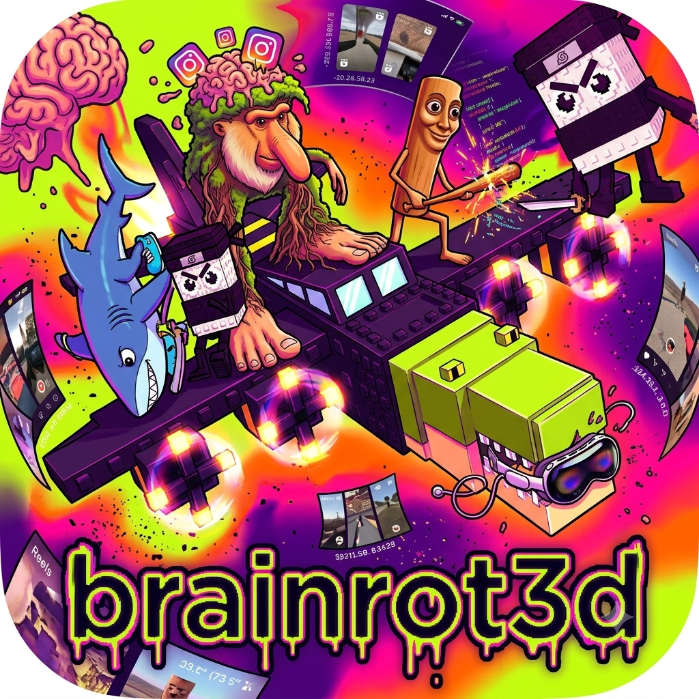
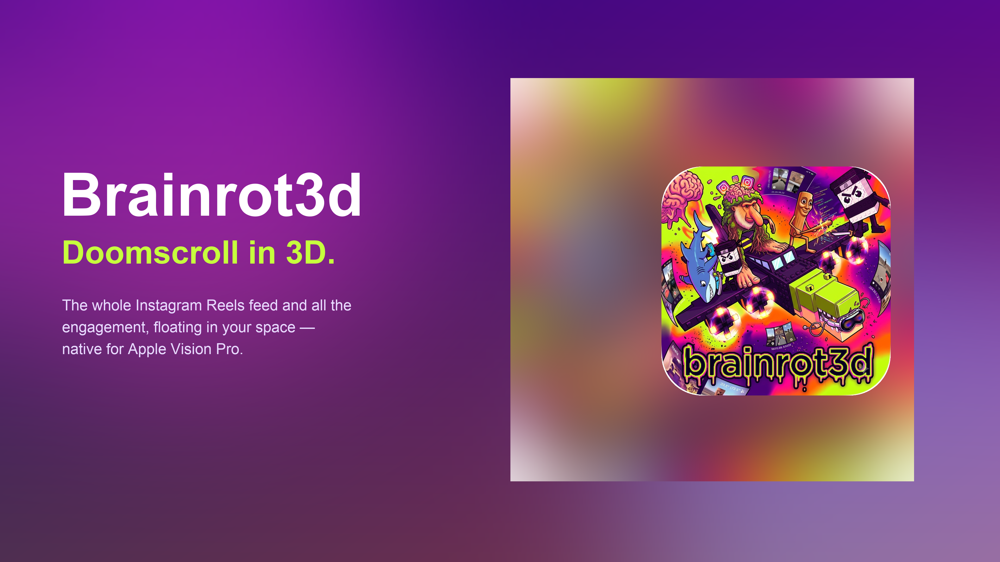
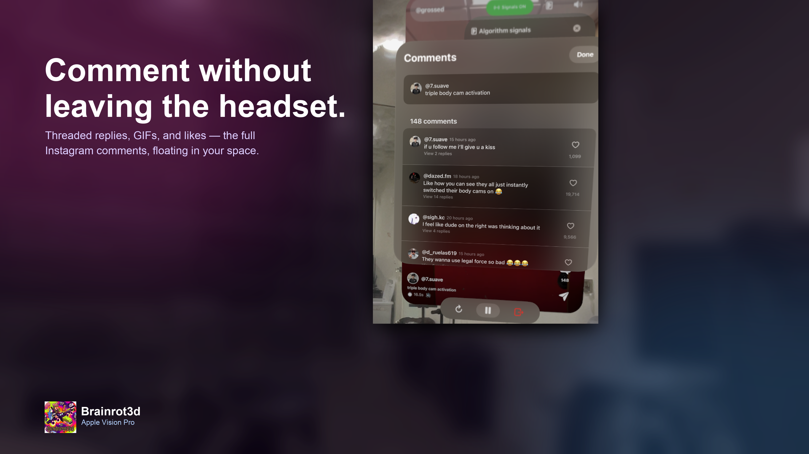
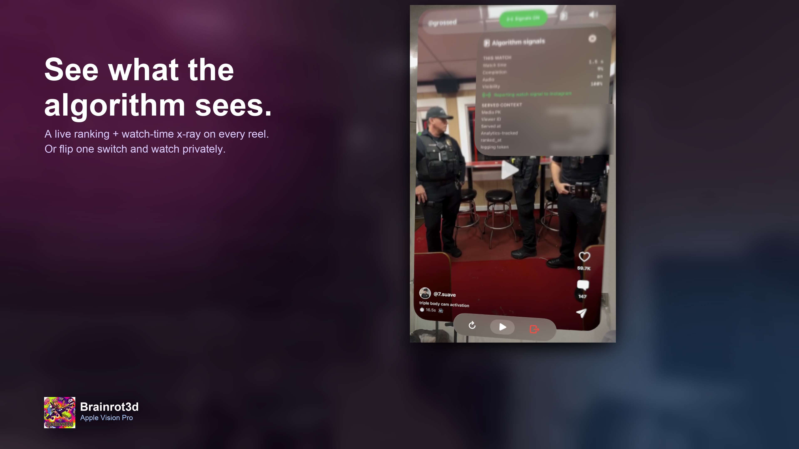

<p align="center">
  
</p>

<h1 align="center">Brainrot3d</h1>

<p align="center"><b>Doomscroll in 3D.</b><br/>
Instagram Reels on Apple Vision Pro — login, feed, and full engagement, all native and on-device.</p>

<p align="center">
  
  
  
  
</p>

<p align="center">
  
</p>
<p align="center">
  
  
</p>

<p align="center"><sub>Store frames 2 &amp; 3 are real Apple Vision Pro captures — the passthrough room is blurred into a backdrop and the viewer id is redacted.</sub></p>

> Independent research / educational project. Not affiliated with Instagram or Meta.
> Uses private endpoints and may violate Instagram's Terms of Service — see the disclaimer.

---

A fully self-contained Apple Vision Pro app for watching Instagram Reels in the headset.
There is no companion server, no webview, and no third-party library. The app speaks the
Instagram private mobile API directly from the device: it logs you in (including
two-factor), pulls the Reels discovery feed, and plays it back as a native spatial,
vertical-paging video feed.

The interesting part of this project is not the app shell. It is that the entire
Instagram client - the login handshake, the password encryption, the token model, and
the Reels endpoints - was reconstructed from static analysis of the decrypted iOS binary
and then reimplemented from scratch in Swift. This README documents how that was done.

---

## 1. Goal

Reproduce, on-device, exactly what the official Instagram iOS app does when it:

1. boots and seeds a device identity,
2. logs a user in with username + password,
3. completes a two-factor challenge,
4. fetches the Reels tab feed and plays the videos.

Constraint: do it with no embedded secrets, no MITM proxy capture, and no helper backend.
Everything had to be derivable from the binary and then run natively in a visionOS app.

---

## 2. Reverse engineering methodology

### 2.1 Working from a decrypted binary

The starting point was the decrypted arm64 Mach-O of the Instagram iOS app
(version 435.0.0, build 999084704, minimum iOS 16.3). Analysis was 100 percent static:
reading strings, symbols, Objective-C class metadata, and Swift type information out of
the binary and its app bundle. No instrumented device, no network interception.

A few practical notes that mattered:

- The binary is large (over a million readable strings, tens of thousands of symbols).
  Some automated "is this decrypted" heuristics gave a false negative because they keyed
  on `objc_class_count == 0`, which is a parser artifact on a binary this big. The
  `__objc_classlist` section is present and readable.
- The app ships SSL pinning (a custom `NSURLAuthenticationChallenge` delegate plus
  `SecKey*` validation). Pinning is irrelevant to a reimplemented client: pinning only
  defends against a man-in-the-middle. Our client is the endpoint and simply trusts the
  real Instagram certificate chain like any normal TLS client.

### 2.2 Separating the real API surface from string noise

Filtering the host strings down to the ones that actually carry API traffic:

- `i.instagram.com` - the private mobile API. All `/api/v1/...` calls go here.
- `b.i.instagram.com` - the same API on an alternate edge.
- `graphql.instagram.com` - GraphQL document-id queries.
- `scontent.cdninstagram.com` / `*.fbcdn.net` - the media CDN that serves the actual
  reel MP4 bytes.

### 2.3 App identity constants

These are assembled in code and confirmed against `Info.plist`:

- `X-IG-App-ID: 124024574287414` (matches `FacebookAppID` in the plist).
- The User-Agent is built in the iOS format:
  `Instagram <version> (<deviceModel>; iOS <os>; <locale>; <lang>; scale=<s>; <WxH>; <build>)`.
- A Bloks version id is carried in `X-Bloks-Version-Id`.

### 2.4 The authentication scheme

The modern build authenticates through Meta's Bloks "CAA" (Caller-Aware Auth) flow, with
the confirmed Bloks action ids present in the binary:

- `com.bloks.www.bloks.caa.login.async.send_login_request`
- `com.bloks.www.bloks.caa.login.async.auth_login_request`
- `com.bloks.www.bloks.caa.login.process_client_data_and_redirect`

In practice the account used here still completes against the classic
`POST /api/v1/accounts/login/` path with an encrypted password, and the server accepts it
(it decrypted the password and advanced to two-factor, which is how the scheme below was
validated as correct).

#### Token model

- On success the server returns `IG-Set-Authorization: Bearer IGT:2:<base64>`.
- The client echoes it on every authenticated call as `Authorization: Bearer IGT:2:<base64>`.
- Two side tokens rotate alongside it: `X-MID` (machine id, set from `ig-set-x-mid`) and
  `X-IG-WWW-Claim` (echoed from `x-ig-set-www-claim`). The user id is carried in
  `IG-U-DS-User-ID`.

#### Password encryption (enc_password)

The password is never sent in clear. It is sealed into a versioned blob:

```
#PWD_INSTAGRAM:4:<unix_ts>:<base64(payload)>
```

where `payload` has this byte layout:

```
[0x01][keyId:1][iv:12][uint16_le(len(rsaEnc))][rsaEnc][gcmTag:16][ciphertext]
```

- `rsaEnc` is an RSA-2048 PKCS#1 v1.5 encryption of a fresh random 32-byte AES key,
  using the server's public key.
- `ciphertext` and `gcmTag` come from AES-256-GCM over the UTF-8 password, with the nonce
  equal to `iv` and the additional authenticated data equal to the ASCII timestamp.

The public key and its key id are not baked into the app. They are delivered live by the
server (`ig-set-password-encryption-pub-key` / `ig-set-password-encryption-key-id`,
returned by `POST /api/v1/qe/sync/`) and they rotate. A note worth recording: the binary
contains a `sodium` string, which initially suggested a libsodium sealed box, but the live
public-key header base64-decodes to a PEM RSA public key. So the real scheme is RSA + AES,
not curve25519. The server decrypting our password is the proof.

#### Two-factor

When the account has 2FA enabled, `accounts/login` returns `two_factor_required` with a
`two_factor_identifier`. The flow is:

- optionally trigger a code with
  `accounts/send_two_factor_login_sms/` or `two_factor/send_two_factor_login_whatsapp/`,
- then `POST /api/v1/accounts/two_factor_login/` with the verification code, the
  identifier, and `verification_method` (1 = SMS, 3 = TOTP/authenticator, 6 = WhatsApp).

The one-time code is a user-possessed runtime value. It is only obtainable from the user,
never from the binary, which is exactly why the app asks for it interactively.

#### Pre-auth device seeding

Before login the app warms up a realistic device. The important call is
`POST /api/v1/qe/sync/`, which seeds `mid` and `x-ig-www-claim` and delivers the password
public key. A device identity (a set of GUIDs: device id, family device id, advertising
id, phone id) is derived deterministically so a session can be resumed as the same
"device", which keeps Instagram's new-device risk checks happy.

### 2.5 Request signing

This build does not HMAC the request body for auth. The legacy
`signed_body=<signature>.<json>` survives only as a literal `SIGNATURE.` prefix in front
of the JSON; integrity is carried instead by the bearer token, `X-IG-WWW-Claim`, `X-MID`,
the Bloks version id, the device GUIDs, and `X-IG-App-ID`.

### 2.6 Reels

The Reels tab feed comes from `POST /api/v1/clips/discover/stream/`. The response is not a
single JSON document. It is an ndjson-style stream of concatenated top-level JSON objects.
Parsing means scanning the body, splitting it into individual JSON values (string-aware
brace matching), and then walking the tree for any media object that has both
`video_versions` and a `pk`. Paging is done by finding a `paging_token` / `next_max_id` /
`max_id` anywhere in the tree and passing it back as `max_id`.

Two supporting endpoints:

- `GET /api/v1/media/{id}/info/` for an individual item's playback URLs.
- `POST /api/v1/clips/write_seen_state/` to register that a reel was watched. This wants a
  flat `media_ids` JSON array; a nested impressions object makes the server return 500.

### 2.7 Engagement

The same media id drives the full set of engagement endpoints, all confirmed live:

- Like / unlike a reel: `POST /api/v1/media/{id}/like/` and `/unlike/`.
- Read comments with threading: `GET /api/v1/media/{id}/comments/`, and a comment's replies
  via `GET /api/v1/media/{id}/comments/{comment_id}/child_comments/`. Animated/GIF comments
  carry their image under `animated_media`.
- Like / unlike a comment: `POST /api/v1/media/{comment_id}/comment_like/` and
  `/comment_unlike/`.
- Who liked it: `GET /api/v1/media/{id}/likers/`.
- Share to direct messages: `GET /api/v1/direct_v2/ranked_recipients/` to list people and
  group threads, then `POST /api/v1/direct_v2/threads/broadcast/media_share/` with
  `thread_ids` and/or a `recipient_users` matrix and an optional `text`.

Live counts (like count, comment count, has-liked, caption, top-liker facepile) come back on
the stream item and are refreshed from `media/{id}/info/`.

### 2.8 Creator profiles

A username resolves to a profile via `GET /api/v1/users/web_profile_info/?username=...`
(with a `GET /api/v1/users/{username}/usernameinfo/` mobile fallback), which carries the
display name, bio, verification, follower and following counts, and the numeric user id.
That id feeds `POST /api/v1/clips/user/` (`target_user_id`, `page_size`, `include_feed_video`,
paginated with `max_id`) to list that creator's own reels.

---

## 3. From Python proof to a native Swift client

The reverse-engineered behaviour was first validated as a small Python client, then ported
to Swift so it could run entirely on visionOS with no backend. The Swift port is a
byte-for-byte reimplementation of the security-sensitive parts so the bytes Instagram sees
are identical to what it already trusts:

- `IGCrypto.swift`
  - SHA-256 device-fingerprint derivation (same seed yields the same GUIDs).
  - `enc_password`: RSA-2048 PKCS#1 v1.5 via the Security framework wrapping a random AES
    key, AES-256-GCM via CryptoKit over the password, assembled into the exact payload
    layout above. Includes a small DER walker that strips the SPKI wrapper off the
    server's public key so `SecKeyCreateWithData` will accept it.
- `IGClient.swift`
  - `URLSession` calls to `i.instagram.com`, header assembly, response-header token
    absorption (`IG-Set-Authorization`, `X-MID`, `X-IG-WWW-Claim`), `qe/sync` seeding,
    `accounts/login`, `two_factor_login`, `clips/discover/stream`, `write_seen_state`,
    and session persistence.
- `Reel.swift`
  - The ndjson stream parser and the reel model (best video version, thumbnail, author).

---

## 4. The Apple Vision Pro app

The app (`Brainrotter3D` target) is plain SwiftUI plus AVFoundation:

- `Brainrotter3DApp.swift` - app entry, a portrait spatial window, audio session setup.
- `ContentView.swift` - a small state machine: launching, login, two-factor, feed.
- `LoginView.swift` - native username/password and two-factor screens, on glass.
- `ReelsFeedView.swift` - a vertical, page-snapping scroll of full-window reels with an
  author overlay, a like/comment/share action rail, a mute toggle, and a glass ornament for
  refresh and log out. It plays only the on-screen reel and prefetches the next page as you
  approach the end. Tap the video or the ornament button to pause and resume; double-tap to
  like.
- `LoopingPlayerView.swift` - an `AVQueuePlayer` + `AVPlayerLooper` view for seamless
  looping playback.
- `TrackingToken.swift` - decoder for a reel's `organic_tracking_token`.
- `Engagement.swift` - the like / comment / reply / comment-like / likers / DM-share client
  calls and their models.
- `CommentsView.swift`, `ShareView.swift` - the comments sheet (with threaded replies, GIF
  comments, and per-comment likes), the DM share sheet (recipient picker, copy-link bar, and
  message), and the likers list.
- `ProfileView.swift` - a creator profile (header plus a grid of their reels) that opens a
  full-window player when you tap a reel.

### Engagement

The action rail on each reel is wired to the engagement endpoints in section 2.7. You can
like and unlike (with an optimistic count and a double-tap heart burst), long-press the heart
to see who liked it, open a comments sheet that loads threaded replies and lets you like
individual comments, and share a reel into your direct-message threads or to individual
people with an optional note or a copied link. Tapping a creator's name or avatar opens their
profile (section 2.8) with a grid of their reels you can play full-window.

### Algorithm signals panel

Each reel in the feed ships ranking and linkage metadata (see section 2). The chart button
in the top bar opens a live panel that surfaces it:

- The "served context" Instagram delivered the reel under: the media PK and viewer id baked
  into the decoded `organic_tracking_token`, the time it was served, whether it is
  analytics-tracked, `ranked_at`, the feed position, and the `logging_info_token`.
- A "this watch" meter measured locally as you watch: watch time, completion percentage,
  audio on/off, and visibility - the same quantities the app's `seen state` model reports.

A toggle in the top bar controls whether the confirmed-live watch signal
(`clips/write_seen_state/`) is actually uploaded to Instagram. It defaults to off, so you
watch privately and nothing is reported; turning it on reports the real view. The panel
only ever measures and displays - it never fabricates or replays signals.

Session tokens are stored on-device so the app resumes straight into the feed on the next
launch.

---

## 5. Build and run

Requirements: Xcode 26 or newer with the visionOS SDK, and
[XcodeGen](https://github.com/yonyz/XcodeGen) to generate the project from `project.yml`.

```sh
# generate the Xcode project
xcodegen generate

# run in the visionOS Simulator
open Brainrotter3D.xcodeproj    # then Run

# or build and install on a connected Apple Vision Pro
xcodebuild -project Brainrotter3D.xcodeproj -scheme Brainrotter3D \
  -destination 'platform=visionOS,id=<your-device-id>' \
  -allowProvisioningUpdates build

xcrun devicectl device install app --device <your-device-id> \
  ~/Library/Developer/Xcode/DerivedData/Brainrotter3D-*/Build/Products/Debug-xros/Brainrotter3D.app
```

On first launch, enter your Instagram credentials in the headset. If your account uses
two-factor, the app will prompt for the code. Signing with a free Apple ID is good for
seven days, after which you rebuild and reinstall.

---

## 6. Disclaimer

This is an independent research and educational project. It is not affiliated with,
authorized by, or endorsed by Instagram or Meta. It interoperates with private endpoints
that can change at any time and using it may be contrary to Instagram's terms of service.
No credentials, tokens, or session material are included in this repository. Use it only
with your own account and at your own risk.
